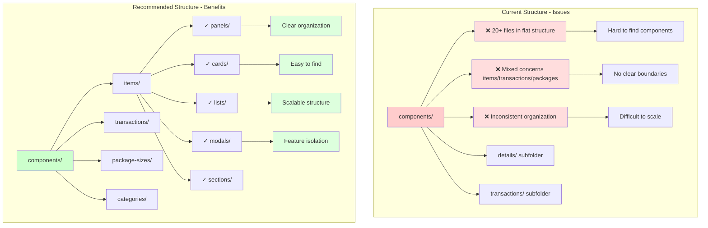

# Inventory Folder Structure Comparison

## Side-by-Side Comparison

### Current Structure vs. Recommended Structure

```
CURRENT (Flat & Inconsistent)              RECOMMENDED (Feature-Based)
═══════════════════════════════            ═══════════════════════════════════

src/pages/Inventory/                       src/pages/Inventory/
├── index.ts                               ├── index.ts
├── InventoryListPage.tsx                  │
├── InventoryItemManagePage.tsx            ├── pages/
├── InventoryTransactionsPage.tsx          │   ├── InventoryListPage.tsx
├── InventoryTransactionDetailsPage.tsx    │   ├── InventoryItemManagePage.tsx
├── InventoryCategoriesListPage.tsx        │   ├── InventoryTransactionsPage.tsx
├── PackageSizesPage.tsx                   │   ├── InventoryTransactionDetailsPage.tsx
│                                          │   ├── InventoryCategoriesListPage.tsx
└── components/                            │   └── PackageSizesPage.tsx
    ├── AdjustInventoryModal.tsx           │
    ├── InitiateCountModal.tsx             └── components/
    ├── InventoryItemDetailPanel.tsx           │
    ├── InventoryItemFormModal.tsx             ├── items/
    ├── InventoryItemListItem.tsx              │   ├── panels/
    ├── InventoryItemSummary.tsx               │   │   └── InventoryItemDetailPanel.tsx
    ├── InventoryTransactionDetailsContent.tsx │   ├── cards/
    ├── InventoryTransactionDetailsPanel.tsx   │   │   ├── InventoryGeneralDetailsCard.tsx
    ├── InventoryTransactionsList.tsx          │   │   ├── InventoryActionsCard.tsx
    ├── InventoryTransactionsListPanel.tsx     │   │   └── InventoryItemSummary.tsx
    ├── InventoryTransactionsSummaryCard.tsx   │   ├── lists/
    ├── PackageSizeFormModal.tsx               │   │   └── InventoryItemListItem.tsx
    ├── PackageSizeListItem.tsx                │   ├── modals/
    ├── PackageSizesList.tsx                   │   │   ├── InventoryItemFormModal.tsx
    ├── ReceiveInventoryModal.tsx              │   │   ├── ReceiveInventoryModal.tsx
    │                                          │   │   ├── AdjustInventoryModal.tsx
    ├── details/                               │   │   └── InitiateCountModal.tsx
    │   ├── InventoryActionButtons.tsx         │   └── sections/
    │   ├── InventoryActionsCard.tsx           │       ├── InventoryItemDetailContent.tsx
    │   ├── InventoryGeneralDetailsCard.tsx    │       ├── InventoryImageSection.tsx
    │   ├── InventoryImageSection.tsx          │       └── InventoryActionButtons.tsx
    │   ├── InventoryItemDetailContent.tsx     │
    │   └── InventoryTransactionSummaryCard.tsx│   ├── transactions/
    │                                          │   │   ├── panels/
    └── transactions/                          │   │   │   ├── InventoryTransactionsListPanel.tsx
        └── InventoryTransactionsContent.tsx   │   │   │   └── InventoryTransactionDetailsPanel.tsx
                                               │   │   ├── cards/
                                               │   │   │   ├── InventoryTransactionsSummaryCard.tsx
                                               │   │   │   └── InventoryTransactionSummaryCard.tsx
                                               │   │   ├── lists/
                                               │   │   │   ├── InventoryTransactionsList.tsx
                                               │   │   │   └── InventoryTransactionsContent.tsx
                                               │   │   └── sections/
                                               │   │       └── InventoryTransactionDetailsContent.tsx
                                               │   │
                                               │   ├── package-sizes/
                                               │   │   ├── modals/
                                               │   │   │   └── PackageSizeFormModal.tsx
                                               │   │   └── lists/
                                               │   │       ├── PackageSizesList.tsx
                                               │   │       └── PackageSizeListItem.tsx
                                               │   │
                                               │   ├── categories/
                                               │   │   └── (future components)
                                               │   │
                                               │   └── shared/
                                               │       └── (cross-feature components)
```

## Visual Hierarchy Diagram



## Component Count by Category

### Current Distribution
```
Root components/          : 15 files
├── details/             : 6 files
└── transactions/        : 1 file
                           ──────
Total                    : 22 component files
```

### Recommended Distribution
```
items/
├── panels/              : 1 file
├── cards/               : 3 files
├── lists/               : 1 file
├── modals/              : 4 files
└── sections/            : 3 files

transactions/
├── panels/              : 2 files
├── cards/               : 2 files
├── lists/               : 2 files
└── sections/            : 1 file

package-sizes/
├── modals/              : 1 file
└── lists/               : 2 files
                           ──────
Total                    : 22 component files (same)
```

## Migration Complexity Matrix

| Task | Complexity | Risk | Estimated Effort |
|------|-----------|------|------------------|
| Create new directories | Low | None | 5 minutes |
| Move page components | Low | Low | 15 minutes |
| Move item components | Medium | Low | 30 minutes |
| Move transaction components | Medium | Low | 30 minutes |
| Move package size components | Low | Low | 15 minutes |
| Update import paths | Medium | Medium | 1-2 hours |
| Update index exports | Low | Low | 30 minutes |
| Testing | High | Medium | 2-3 hours |
| **Total** | **Medium** | **Low-Medium** | **5-7 hours** |

## Decision Matrix

| Criteria | Current | Option 1 (Feature-Based) | Option 2 (Type-Based) | Option 3 (Hybrid) |
|----------|---------|--------------------------|----------------------|-------------------|
| **Findability** | ⭐⭐ | ⭐⭐⭐⭐⭐ | ⭐⭐⭐⭐ | ⭐⭐⭐⭐ |
| **Scalability** | ⭐⭐ | ⭐⭐⭐⭐⭐ | ⭐⭐⭐ | ⭐⭐⭐⭐ |
| **Feature Isolation** | ⭐ | ⭐⭐⭐⭐⭐ | ⭐⭐ | ⭐⭐⭐⭐ |
| **Consistency** | ⭐⭐ | ⭐⭐⭐⭐⭐ | ⭐⭐⭐⭐⭐ | ⭐⭐⭐⭐ |
| **Learning Curve** | N/A | ⭐⭐⭐⭐ | ⭐⭐⭐⭐⭐ | ⭐⭐⭐⭐ |
| **Refactoring** | ⭐ | ⭐⭐⭐⭐⭐ | ⭐⭐⭐ | ⭐⭐⭐⭐ |
| **Import Paths** | ⭐⭐ | ⭐⭐⭐⭐ | ⭐⭐⭐⭐⭐ | ⭐⭐⭐⭐ |
| **Co-location** | ⭐⭐ | ⭐⭐⭐⭐⭐ | ⭐⭐⭐ | ⭐⭐⭐⭐ |
| **Overall Score** | **12/40** | **37/40** | **31/40** | **34/40** |

## Example: Finding a Component

### Current Structure
**Task:** Find the component that displays transaction details

**Process:**
1. Look in `components/` (15+ files to scan)
2. Not in root, check subdirectories
3. Check `details/` folder (6 files)
4. Not there, check `transactions/` folder
5. Not there either, back to root
6. Find `InventoryTransactionDetailsContent.tsx`

**Time:** 30-60 seconds (scanning required)

### Recommended Structure
**Task:** Find the component that displays transaction details

**Process:**
1. Go to `components/transactions/` (feature-based)
2. Look in `sections/` (component type)
3. Find `InventoryTransactionDetailsContent.tsx`

**Time:** 5-10 seconds (direct path)

## Import Statement Examples

### Current (Inconsistent Paths)
```typescript
// From InventoryListPage.tsx
import InventoryItemDetailPanel from './components/InventoryItemDetailPanel';
import InventoryItemFormModal from './components/InventoryItemFormModal';
import InventoryTransactionsListPanel from './components/InventoryTransactionsListPanel';

// These are in subdirectories
import InventoryGeneralDetailsCard from './components/details/InventoryGeneralDetailsCard';
import InventoryTransactionsContent from './components/transactions/InventoryTransactionsContent';
```

### Recommended (Consistent Paths)
```typescript
// From InventoryListPage.tsx - Option A: Direct imports
import InventoryItemDetailPanel from './components/items/panels/InventoryItemDetailPanel';
import InventoryItemFormModal from './components/items/modals/InventoryItemFormModal';
import InventoryTransactionsListPanel from './components/transactions/panels/InventoryTransactionsListPanel';
import InventoryGeneralDetailsCard from './components/items/cards/InventoryGeneralDetailsCard';
import InventoryTransactionsContent from './components/transactions/lists/InventoryTransactionsContent';

// Option B: Barrel exports (with index.ts files)
import {
  InventoryItemDetailPanel,
  InventoryItemFormModal,
  InventoryGeneralDetailsCard,
} from './components/items';

import {
  InventoryTransactionsListPanel,
  InventoryTransactionsContent,
} from './components/transactions';
```

## Benefits Summary

### Immediate Benefits
- ✅ **Clear feature boundaries** - Items, transactions, and packages are clearly separated
- ✅ **Consistent structure** - Same subdirectories (panels/, modals/, cards/, lists/) across features
- ✅ **Easier navigation** - Developers know exactly where to find components
- ✅ **Better mental model** - Feature-first thinking matches user workflows

### Long-term Benefits
- ✅ **Scalability** - Easy to add new features without cluttering existing directories
- ✅ **Maintainability** - Related components are co-located
- ✅ **Refactoring** - Moving features to separate packages is straightforward
- ✅ **Onboarding** - New developers can understand the structure quickly
- ✅ **Testing** - Test files can be co-located with components
- ✅ **Documentation** - Each feature can have its own README

### Developer Experience
- ✅ **IDE navigation** - File trees are easier to browse
- ✅ **Search efficiency** - Narrower search scopes
- ✅ **Import autocomplete** - Better suggestions from IDEs
- ✅ **Code review** - Changes are grouped by feature
- ✅ **Git history** - Easier to track feature evolution

## Next Steps

1. **Review proposal** with the team
2. **Get approval** for the recommended structure
3. **Create migration plan** with detailed steps
4. **Set up feature branch** for the reorganization
5. **Execute migration** in phases
6. **Test thoroughly** after each phase
7. **Update documentation** with new structure
8. **Merge to main** when stable
