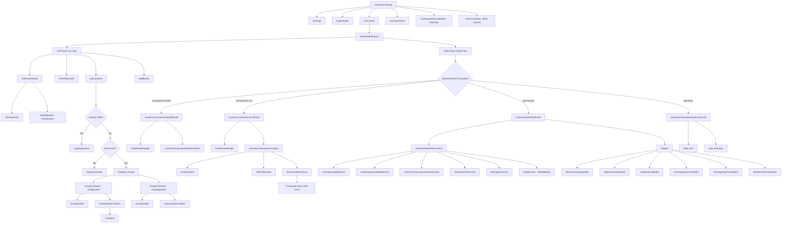

# InventoryListPage Component Hierarchy

## Visual Diagram



## Component Structure Outline

### Root Component: **InventoryListPage**

#### **Ionic Components**
- `IonPage` - Page container
- `PageHeader` - Top navigation header
- `IonContent` - Main content container
- `IonActionSheet` - Action sheet for more options

#### **Layout Components**
- **MasterDetailLayout**
  - **Left Panel** (List View)
    - `LeftPanelHeader` (Styled div)
      - `IonSearchbar` - Search inventory items
      - `HeaderButton` (IonButton) - Navigate to transactions
    - `FilterPillScroller` - Category and stock filters
    - `ListContainer` (Styled div)
      - Conditional rendering:
        - `LoadingSpinner` (if loading)
        - `EmptyContainer` (if no items)
        - Category Groups (if items exist)
          - `GroupContainer` (for each category)
            - `GroupHeader` - Category name and count
            - `InventoryItemListItem` (for each item)
              - `CardItem` - Shared card component
                - Item details (name, cost, stock)
                - Stock badges (low/out of stock)
          - `GroupContainer` (uncategorized items)
            - `GroupHeader`
            - `InventoryItemListItem`
    - `AddButton` - Add new inventory item

  - **Right Panel** (Detail View) - Conditional rendering based on state

    **Option 1: Transaction Details** (`selectedTransactionId` is set)
    - `InventoryTransactionDetailsPanel`
      - `DetailPanelHeader` - Back button and title
      - `InventoryTransactionDetailsContent` - Transaction details

    **Option 2: Transactions List** (`showTransactionsList` is true)
    - `InventoryTransactionsListPanel`
      - `DetailPanelHeader` - Back button and title
      - `InventoryTransactionsContent`
        - `IonSearchbar` - Search transactions
        - `FilterPillScroller` - Transaction type filters
        - `IonList` with `IonItemGroup`
          - Grouped by date
          - Transaction items with circular icons
          - Transaction details

    **Option 3: Item Details** (`selectedItemId` is set)
    - `InventoryItemDetailPanel`
      - `CenteredLayout`
        - `InventoryItemDetailContent`
          - `InventoryImageSection` - Item image upload
          - `InventoryGeneralDetailsCard` - Item details
          - `InventoryTransactionSummaryCard` - Transaction stats
          - `InventoryActionsCard` - Action buttons
          - `PackageSizesList` - Package sizes management
          - `DangerZone` (if admin)
            - `DeleteButton` - Delete item
      - **Modals** (conditionally rendered)
        - `ReceiveInventoryModal`
        - `AdjustInventoryModal`
        - `InitiateCountModal`
        - `InventoryItemFormModal` (edit)
        - `PackageSizeFormModal`
        - `DeleteConfirmationAlert` (x2)
      - `IonActionSheet` - More options

    **Option 4: Transaction Summary** (default)
    - `InventoryTransactionsSummaryCard`
      - Stats Grid (Receipts, Sales, Adjustments)
      - View All Transactions button

#### **Modals** (Root level)
- `InventoryItemFormModal` - Add new item
- `IonActionSheet` - Inventory options

## Key Shared Components Used

### Layout Components
- `MasterDetailLayout` - Split pane layout (from @/components/layouts)
- `CenteredLayout` - Centered content wrapper
- `PlaceholderContainer` - Empty state container

### Shared Components
- `PageHeader` - Top navigation
- `CardContainer` - Card wrapper
- `CardItem` - List item card
- `DetailPanelHeader` - Detail panel header with back button
- `DeleteConfirmationAlert` - Delete confirmation dialog
- `DeleteButton` - Danger zone delete button

### UI Components
- `FilterPillScroller` - Horizontal scrollable filter pills
- `LoadingSpinner` - Loading indicator

### Ionic Components
- `IonPage`, `IonContent` - Page structure
- `IonSearchbar` - Search input
- `IonButton`, `IonIcon` - Buttons and icons
- `IonActionSheet` - Action sheets
- `IonList`, `IonItem`, `IonLabel` - List components
- `IonItemGroup`, `IonItemDivider` - Grouped lists

## State Management

### Primary State Variables
- `searchText` - Search query
- `showItemModal` - Add item modal visibility
- `showActionSheet` - Action sheet visibility
- `selectedFilter` - Active filter (all/stock/category)
- `selectedItemId` - Currently selected item
- `showTransactionsList` - Transaction list view toggle
- `selectedTransactionId` - Selected transaction for details

### Conditional Rendering Logic
1. **No shop selected** → Show placeholder
2. **Loading** → Show loading spinner
3. **No items** → Show empty state
4. **Has items** → Show grouped list
5. **Right panel** (in order of precedence):
   - Transaction details (if `selectedTransactionId`)
   - Transactions list (if `showTransactionsList`)
   - Item details (if `selectedItemId`)
   - Transaction summary (default)

## Navigation Patterns

### Desktop (Tablet+)
- List and detail panels shown side-by-side
- Clicking items updates the right panel
- State managed within component

### Mobile
- List view only
- Clicking items navigates to detail pages
- Uses React Router for navigation

## Component File Locations

```
src/pages/Inventory/
├── InventoryListPage.tsx
├── components/
│   ├── InventoryItemListItem.tsx
│   ├── InventoryItemDetailPanel.tsx
│   ├── InventoryItemFormModal.tsx
│   ├── InventoryTransactionDetailsPanel.tsx
│   ├── InventoryTransactionDetailsContent.tsx
│   ├── InventoryTransactionsListPanel.tsx
│   ├── InventoryTransactionsSummaryCard.tsx
│   ├── details/
│   │   ├── InventoryItemDetailContent.tsx
│   │   └── InventoryImageSection.tsx
│   ├── transactions/
│   │   └── InventoryTransactionsContent.tsx
│   ├── InventoryGeneralDetailsCard.tsx
│   ├── InventoryActionsCard.tsx
│   ├── InventoryTransactionSummaryCard.tsx
│   ├── PackageSizesList.tsx
│   ├── ReceiveInventoryModal.tsx
│   ├── AdjustInventoryModal.tsx
│   ├── InitiateCountModal.tsx
│   └── PackageSizeFormModal.tsx
```
